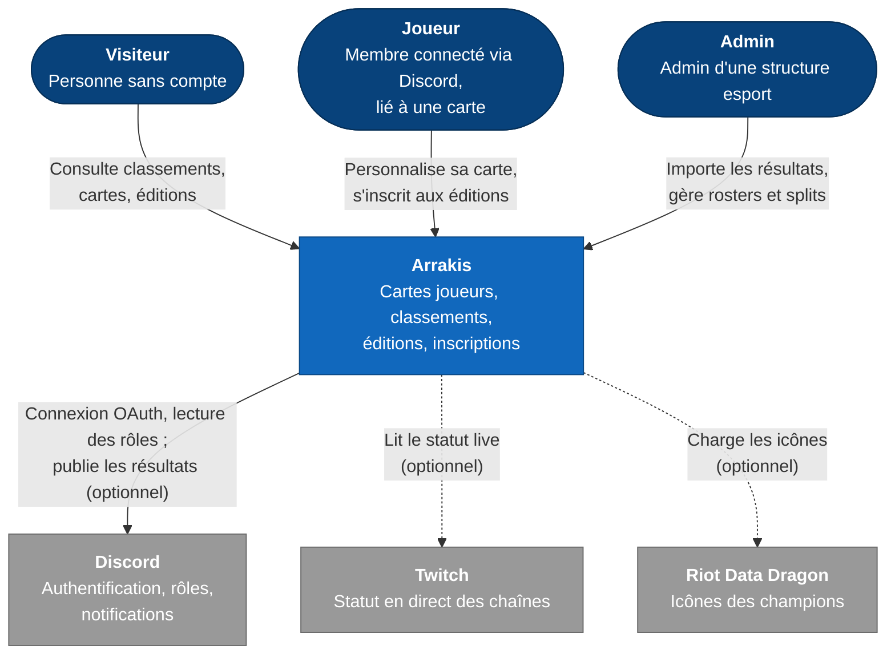
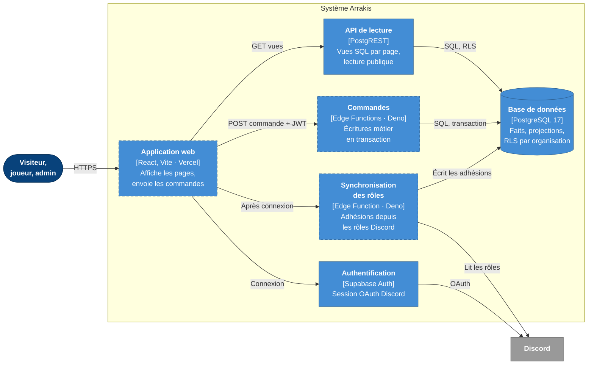
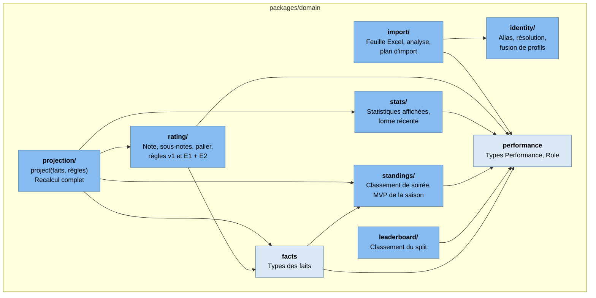
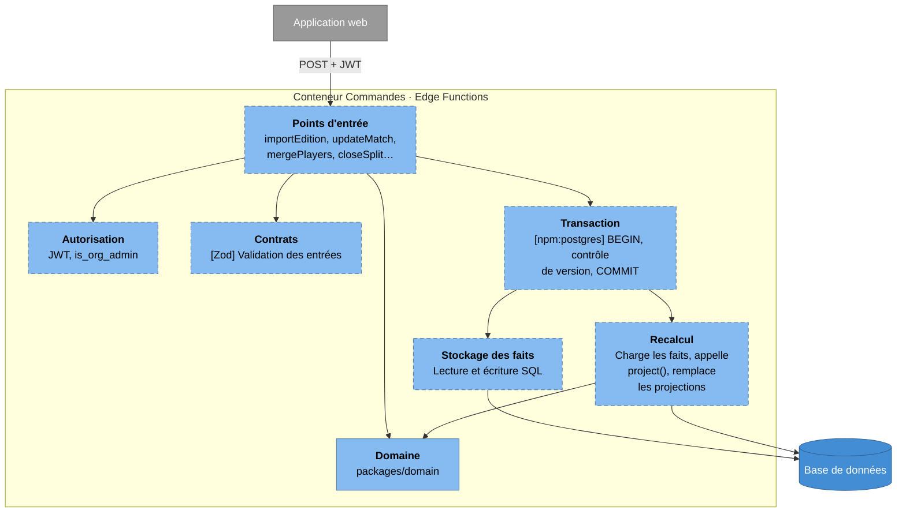
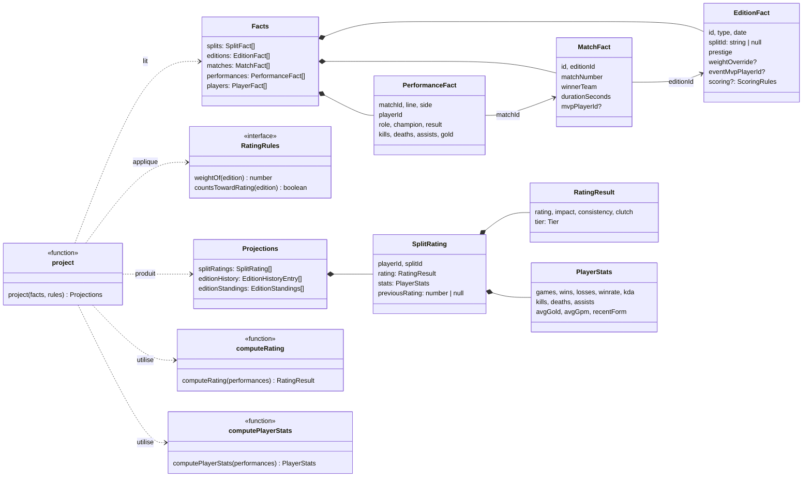

# Architecture : modèle C4

Le [modèle C4](https://c4model.com) décrit un logiciel en quatre niveaux de
zoom, du plus large au plus fin :

1. **Contexte** : le système, ses utilisateurs et les systèmes externes.
2. **Conteneurs** : les applications et bases de données qui le composent.
3. **Composants** : l'intérieur d'un conteneur.
4. **Code** : les types et fonctions d'un composant.

Légende commune :

- Rectangle arrondi gris foncé : personne.
- Rectangle bleu : élément du système Arrakis.
- Rectangle gris : système ou élément externe.
- **Bordure en pointillés : prévu, pas encore construit.**

## Niveau 1 : contexte

Les flèches en pointillés sont des dépendances **optionnelles** : le site
fonctionne sans elles ([ADR 0008](../adr/0008-multi-tenant-et-portabilite.md)).

## Niveau 2 : conteneurs

Le **domaine** (`packages/domain`) n'est pas un conteneur : c'est une
bibliothèque, embarquée à la fois dans l'application web (aperçu d'un import)
et dans les commandes. Il apparaît au niveau 3.

## Niveau 3 : composants

### Le domaine (`packages/domain`)

Les flèches indiquent qui dépend de qui. Aucun module ne dépend de React, de
Supabase ou de Node ([ADR 0001](../adr/0001-monorepo-et-domaine-pur.md)).

### Les commandes (prévu)

## Niveau 4 : code

Zoom sur le cœur du recalcul : les types que `project()` consomme et produit.
C'est le niveau le plus détaillé, et le seul que l'on peut aussi lire
directement dans le code ; il est utile ici pour voir les relations d'un coup
d'œil.

