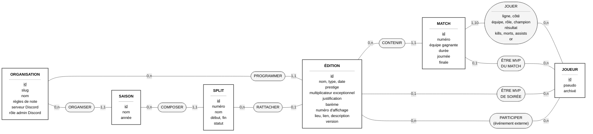
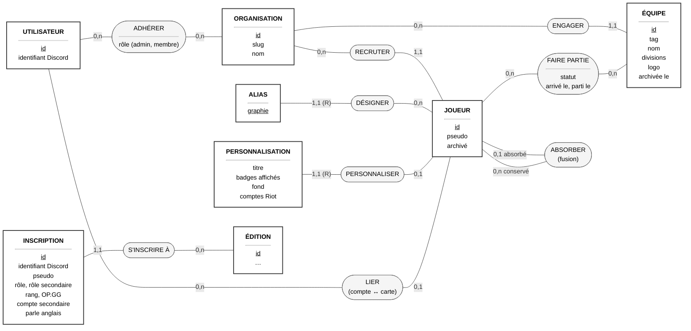
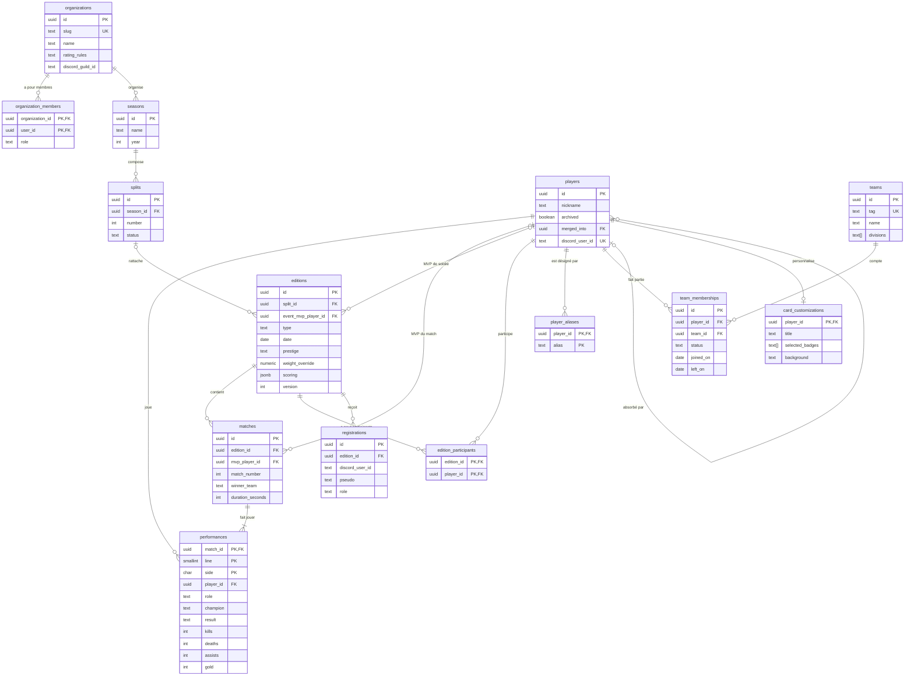
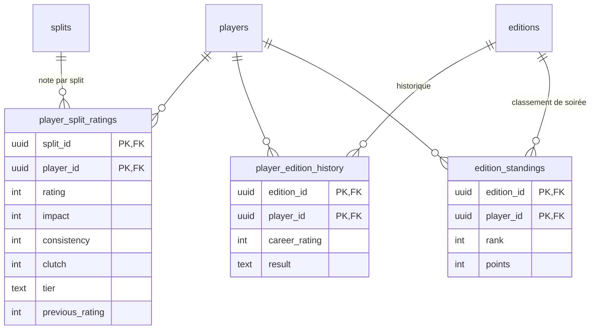

# Modèle de données (Merise)

Ce document suit la démarche Merise, en deux niveaux :

1. **MCD** (modèle conceptuel de données) : les entités du métier, leurs
   associations et leurs cardinalités, indépendamment de toute base de données.
2. **MLD** (modèle logique de données) : sa traduction en tables relationnelles,
   telle qu'implémentée dans
   [la migration initiale](../../supabase/migrations/20261005000000_initial_schema.sql).

Les termes suivent le [glossaire](../domain/glossary.md).

## MCD

### Conventions

- **Rectangle** : entité. L'identifiant est souligné.
- **Ovale** : association, avec ses éventuelles propriétés.
- **Cardinalités `min,max`** sur chaque patte : combien de fois une occurrence
  de l'entité participe à l'association. Exemple : un match est contenu dans
  `1,1` édition ; une édition contient `0,n` matchs.
- **`(R)`** : identification relative. L'entité n'est identifiable qu'à travers
  l'entité à laquelle elle est rattachée.

Les **données calculées** (notes, historiques, classements) ne figurent pas
dans un MCD : ce sont des projections, recalculées à partir des faits
([ADR 0003](../adr/0003-faits-et-projections.md)). Elles sont décrites plus
bas, dans le MLD.

Le MCD est présenté en deux vues pour rester lisible. Les entités `JOUEUR` et
`ÉDITION` apparaissent dans les deux.

### Vue 1 : la compétition

À lire, par exemple :

- Un match fait jouer **de 1 à 10** joueurs (5 rôles × 2 équipes) ; un joueur
  joue **0 à n** matchs. Les statistiques du joueur sont des **propriétés de
  l'association** JOUER : elles n'appartiennent ni au joueur ni au match seuls.
- Une édition est rattachée à **0 ou 1** split : un événement externe peut
  n'appartenir à aucun split.

### Vue 2 : les personnes et les équipes

À lire, par exemple :

- Un alias désigne **exactement un** joueur, et n'est identifiable qu'à travers
  lui `(R)` : deux joueurs homonymes peuvent porter la même graphie
  ([ADR 0004](../adr/0004-identite-joueur-par-id.md)).
- FAIRE PARTIE est une association **historisée** : un joueur a plusieurs
  passages dans des équipes, au plus un en cours (sans date de départ).
- ABSORBER est **réflexive** : un joueur absorbé par une fusion pointe vers le
  joueur conservé.
- Un utilisateur peut être lié à une carte dans **plusieurs** organisations,
  mais à une seule par organisation.

## MLD

Traduction du MCD en tables, selon les règles Merise usuelles :

| Cas du MCD                           | Traduction                                                          |
| ------------------------------------ | ------------------------------------------------------------------- |
| Entité                               | Une table, l'identifiant devient la clé primaire                    |
| Association `0,n` / `1,1` (ou `0,1`) | La table du côté `1,1` (ou `0,1`) reçoit une clé étrangère          |
| Association `0,n` / `0,n`            | Une table d'association, dont la clé primaire combine les deux clés |
| Propriétés d'une association         | Colonnes de la table qui la porte                                   |
| Identification relative `(R)`        | La clé de l'entité « parente » entre dans la clé primaire           |

Deux règles propres à Arrakis, non représentées pour alléger le schéma :

- **Chaque table porte un `organization_id` obligatoire** et ses clés
  étrangères sont **composites** `(organization_id, id)` : la base refuse
  qu'une ligne référence une ligne d'une autre organisation
  ([ADR 0008](../adr/0008-multi-tenant-et-portabilite.md)).
- Les utilisateurs sont gérés par Supabase Auth (`auth.users`) ; le lien
  compte ↔ carte passe par l'identifiant Discord.

### Faits

### Projections

Recalculées entièrement par `project()` après chaque commande. Supprimer ces
tables puis relancer le recalcul redonne le même état.

