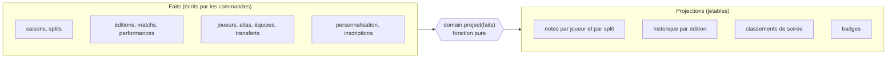
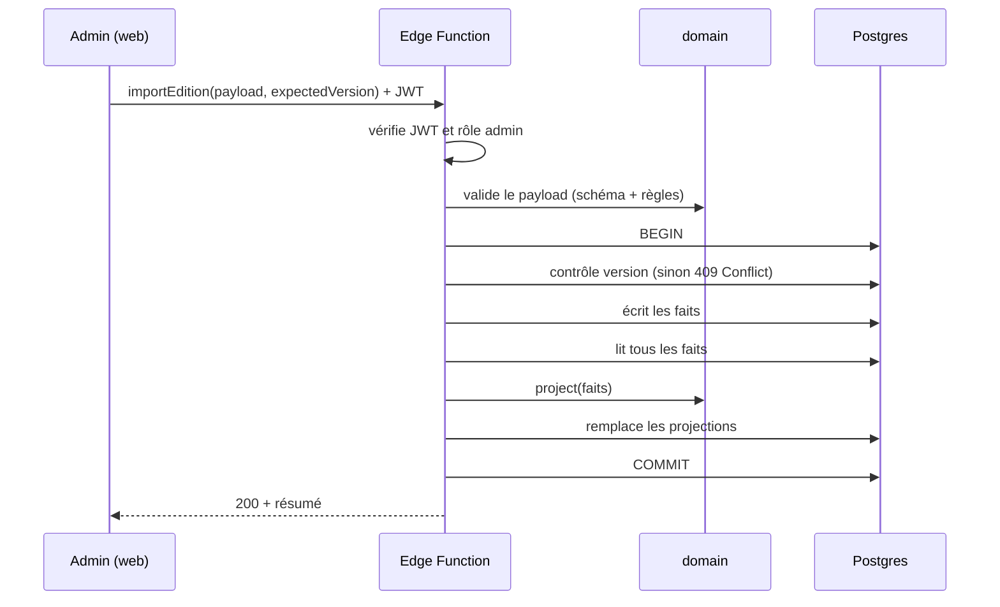

# Vue d'architecture

Ce document montre les grands blocs et la circulation des données. Le _pourquoi_
de chaque choix est dans les [ADR](../adr/README.md).

## Diagrammes

- [Modèle C4](c4.md) : contexte, conteneurs, composants, code.
- [Modèle de données](data-model.md) : MCD Merise et MLD.

Ce document se concentre sur la circulation des données.

## Faits et projections

Le cœur du modèle ([ADR 0003](../adr/0003-faits-et-projections.md)).



Schéma indicatif, à figer en phase 3 :

| Faits                                               | Projections                                                                         |
| --------------------------------------------------- | ----------------------------------------------------------------------------------- |
| `seasons`, `splits`                                 | `player_split_ratings` (note, sous-notes, palier, forme ; `is_final` après clôture) |
| `editions` (avec `scoring`, `version`)              | `player_edition_history`                                                            |
| `matches`, `performances` (`player_id` obligatoire) | `edition_standings`                                                                 |
| `players`, `player_aliases`                         | `player_badges`                                                                     |
| `teams`, `team_memberships` (datées)                |                                                                                     |
| `card_customizations`, `registrations`              |                                                                                     |
| `edition_participants` (événements externes)        |                                                                                     |

Règles :

- Les projections ne sont écrites **que** par le recalcul, dans la même
  transaction que la commande qui les a rendues obsolètes.
- Supprimer toutes les projections puis relancer le recalcul doit redonner
  exactement le même état (test automatique).
- Les instantanés de split clos sont recalculés comme le reste. « Figé »
  signifie que le split ne reçoit plus de nouveaux matchs, pas que la valeur
  est stockée à part.

## Chemin d'écriture : une commande



En cas d'erreur à n'importe quelle étape : `ROLLBACK`, rien n'a changé.

## Chemin de lecture

Une vue SQL par besoin de page (`leaderboard_view`, `player_profile_view`,
`edition_page_view`…), exposée en lecture publique. La page ne télécharge
que ce qu'elle affiche. Le cache côté navigateur est géré par TanStack Query.

## Structure du dépôt (cible)

```
arrakis/
├── apps/
│   └── web/                 React, pages, composants (design repris de la v1)
├── packages/
│   ├── domain/              Règles métier pures — zéro dépendance runtime
│   │   └── src/
│   │       ├── rating/      Note, sous-notes, palier, fiabilité
│   │       ├── standings/   Classement, classement de soirée
│   │       ├── identity/    Alias, résolution de pseudo, fusion
│   │       ├── import/      Analyse d'un import Excel (sans lire le fichier)
│   │       └── projection/  project(faits) → projections
│   └── contracts/           Schémas Zod des commandes et des vues
├── supabase/
│   ├── migrations/
│   ├── functions/           Une fonction par commande
│   └── tests/               pgTAP : RLS et contraintes
├── tools/
│   └── golden-master/       Extraction des données v1 et des notes attendues
└── docs/
```

## Ce qui n'est pas encore décidé

- Le partage du package `domain` avec le runtime Deno des Edge Functions :
  à valider par un spike ([ADR 0005](../adr/0005-ecritures-par-commandes.md)).
- La formule de note v2 ([Q1](../open-questions.md)).
- Le schéma SQL exact (phase 3).
